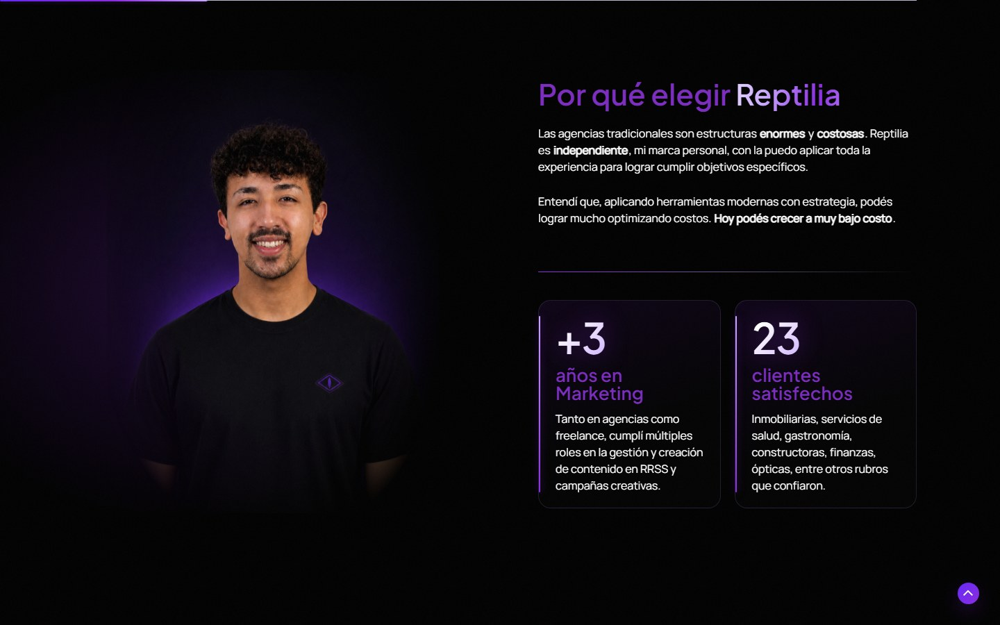
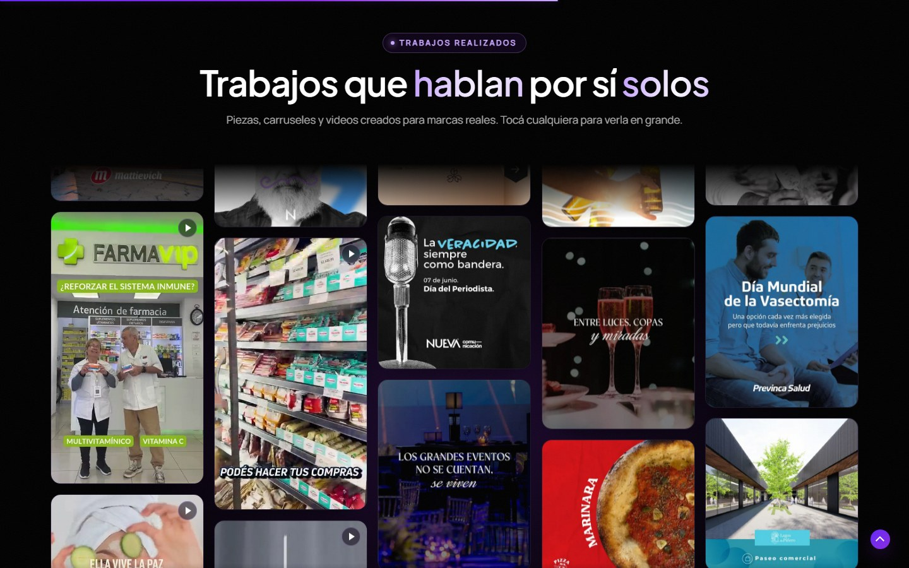
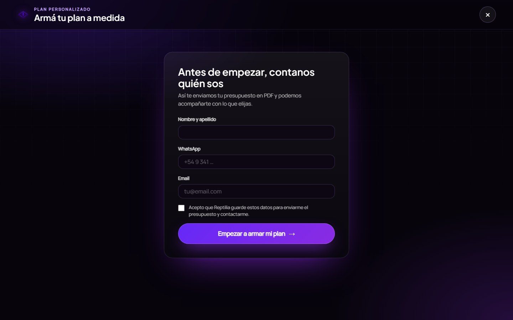
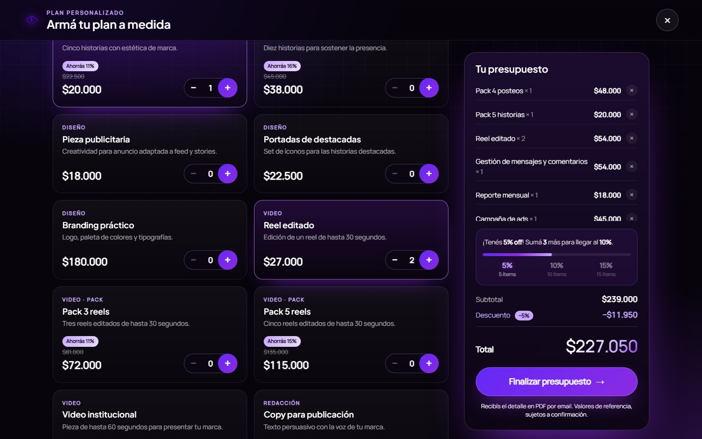
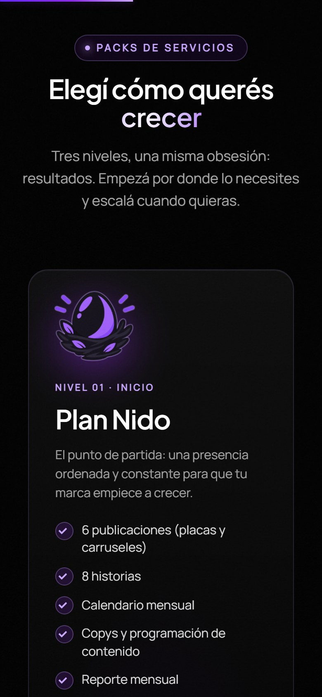
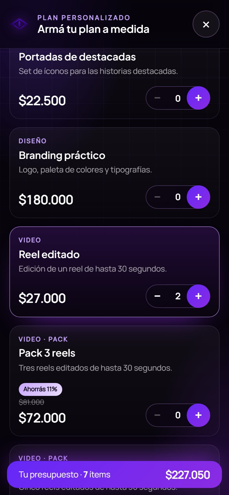
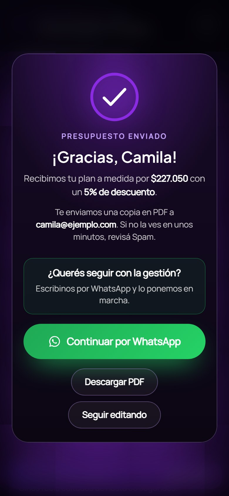

<div align="center">

# 🐍 Reptilia Motion

**Plugin de WordPress hecho a medida para [Reptilia Marketing](https://reptiliamarketing.online):**
animaciones de portada, muro de portfolio y una calculadora de presupuestos que capta contactos, genera un PDF y avisa por correo.


**▶ Verlo funcionando: [reptiliamarketing.online](https://reptiliamarketing.online)** · en producción desde octubre de 2026

</div>

---

## ¿Qué problema resuelve?

Una agencia unipersonal necesita **verse como una agencia grande** y, a la vez, **captar clientes sin estar disponible las 24 horas**. Este plugin le da a la web:

1. Una presentación con movimiento y personalidad de marca (cyber-noir, negro y violeta).
2. Una prueba social visible: un muro de trabajos reales con imágenes y videos.
3. Un canal de ventas autónomo: el cliente arma su propio presupuesto, deja sus datos, recibe un PDF y es llevado a WhatsApp para cerrar.

Todo en **JavaScript y PHP puros, sin librerías externas ni procesos de compilación**, para que la web siga siendo liviana.

---

## 🎬 Portada animada

Intro con cortina, hero con efectos, revelado progresivo de secciones, contadores animados, marquesina de logos con recorte automático y tarjetas con efecto de brillo.

<table>
  <tr>
    <td width="50%"></td>
    <td width="50%"></td>
  </tr>
  <tr>
    <td align="center"><sub>Presentación personal con contadores animados</sub></td>
    <td align="center"><sub>Tres planes con su ilustración y el recomendado destacado</sub></td>
  </tr>
</table>

**Detalles de ingeniería**
- Las animaciones nunca bloquean el contenido: si el script falla o tarda más de 3,5 s, la página se muestra completa y sin movimiento (`rp-failed`).
- Respeta `prefers-reduced-motion`.
- El revelado usa `IntersectionObserver`, no escucha el scroll.
- Los logos de clientes se recortan solos con un `canvas` para que todos tengan el mismo tamaño visual, aunque el archivo original traiga márgenes distintos.

---

## 🖼️ Muro de portfolio

Shortcode `[reptilia_portfolio]`: columnas que se desplazan en sentidos opuestos, con imágenes y videos, y un visor a pantalla completa al tocar cualquier pieza.



- Lee un `manifest.json` desde `uploads/reptilia-portfolio/`: agregar un trabajo es sumar un archivo y una línea, sin tocar código.
- Cada video tiene una versión corta en bucle (6 s, sin audio, 360p) para el muro, y otra completa que solo se carga al abrir el visor. Así 14 videos pesan poco en la carga inicial.
- Incluye una versión estática de respaldo para quienes no tienen JavaScript.

---

## 🧮 Calculadora de presupuestos

Un panel a pantalla completa que se abre desde cualquier enlace a `#calculadora`. El cliente deja sus datos, elige servicios, ve el total actualizarse al instante y recibe su presupuesto en PDF.

<table>
  <tr>
    <td width="33%"></td>
    <td width="33%"></td>
    <td width="33%"></td>
  </tr>
  <tr>
    <td align="center"><sub><b>1.</b> Datos de contacto</sub></td>
    <td align="center"><sub><b>2.</b> Servicios y descuento</sub></td>
    <td align="center"><sub><b>3.</b> Confirmación y WhatsApp</sub></td>
  </tr>
</table>

**Qué hace**
- **Captación de contactos:** nombre, WhatsApp y email, con consentimiento explícito, guardados en un tipo de contenido privado (menú *Presupuestos* del panel). Se guarda aunque el cliente no termine el presupuesto.
- **Filtros y moneda:** por categoría, tipo de cliente (particular / pyme / empresa) y pesos o dólares, con cotización oficial en vivo (dolarapi.com, cacheada 12 h y con valor de respaldo si la API falla).
- **Descuentos por volumen:** 5, 10 y 15 ítems → 5 %, 10 % y 15 %, con barra de progreso y marca visible.
- **PDF propio:** generado sin librerías (`includes/class-rp-pdf.php`, un escritor mínimo de PDF 1.4 con tipografías estándar y logo en JPEG).
- **Correos:** copia con el PDF adjunto al cliente y aviso al dueño con los datos del contacto.
- **Cierre hacia WhatsApp:** ventana de agradecimiento que confirma el envío e invita a seguir por WhatsApp, con el mensaje ya escrito.
- **Exportación a Excel:** botón en el panel que baja todos los contactos en CSV.

<table>
  <tr>
    <td width="25%"></td>
    <td width="25%"></td>
    <td width="25%"></td>
    <td width="25%"></td>
  </tr>
  <tr>
    <td colspan="4" align="center"><sub>Todo está pensado primero para celular: en pantallas chicas el resumen del presupuesto pasa a una barra inferior fija.</sub></td>
  </tr>
</table>

### Decisiones técnicas

| Decisión | Por qué |
|---|---|
| **El precio se recalcula siempre en el servidor** | El navegador solo muestra; nunca se confía en un total enviado desde el cliente. |
| **Contactos como tipo de contenido privado** (`rp_presupuesto`) | Sin tablas propias: se aprovecha el panel, los permisos y los respaldos de WordPress. |
| **Endpoints REST con token por contacto** | `POST /reptilia/v1/lead`, `POST /reptilia/v1/presupuesto` y `GET /reptilia/v1/presupuesto/{id}/pdf`. El PDF solo se descarga con el token de ese contacto. |
| **Anti-spam sin campo trampa** | Se mide el tiempo de llenado y se marca el envío, más un límite de intentos por IP. Un campo oculto clásico (*honeypot*) lo completaba el autocompletado del navegador y bloqueaba a clientes reales. |
| **Correos en segundo plano** | La respuesta vuelve al navegador primero y los correos salen después (`litespeed_finish_request`). La confirmación pasó de ~8 s a ~0,5 s. |
| **PDF sin dependencias** | Evita sumar una librería pesada para generar una sola página. |
| **Numeración correlativa interna** | Los presupuestos llevan número (`RP-0001`) solo para uso del dueño; el cliente no lo ve. |

---

## 🚀 Instalación

1. Copiar la carpeta a `wp-content/plugins/reptilia-motion/` y activarla.
2. Subir el material del portfolio a `wp-content/uploads/reptilia-portfolio/` con su `manifest.json` (no se incluye en este repositorio).
3. Configurar el envío de correos con un SMTP real (por ejemplo SureMail con una cuenta de Gmail y contraseña de aplicación). Sin eso, los correos del hosting suelen no llegar.

## ⚙️ Configuración

- **Destinatario del aviso:** opción de WordPress `rp_calc_owner_email` (si no existe, usa el email de administrador del sitio).
- **Constantes** al inicio de `includes/calculator.php`:

| Constante | Para qué sirve |
|---|---|
| `RP_CALC_WHATSAPP` | Número del botón "Continuar por WhatsApp" |
| `RP_CALC_USD_FALLBACK` | Cotización de respaldo si falla la consulta en vivo |

- **Servicios y precios** (base Pyme, en pesos): `rp_calc_config()`.

> Las animaciones apuntan a los IDs de elementos de Elementor de la portada de Reptilia, así que en otro sitio habría que adaptar esos selectores.

## 🗂️ Estructura

```
reptilia-motion/
├── reptilia-motion.php        # arranque, intro, shortcode del portfolio
├── assets/
│   ├── motion.css / motion.js # portada animada y muro de portfolio
│   └── calc.css  / calc.js    # panel de la calculadora
└── includes/
    ├── calculator.php         # servicios, precios, REST, correos, panel de admin
    └── class-rp-pdf.php       # escritor mínimo de PDF
```

## 🏷️ Versiones

El historial está etiquetado:

`v1.0` animaciones → `v1.1` retrato y packs → `v1.2` planes → `v1.3` portfolio → `v1.4` calculadora → `v1.5` confirmación instantánea y correos en segundo plano.

## 📄 Licencia

Código publicado como referencia de portfolio. Todos los derechos reservados salvo que se indique lo contrario. Las marcas y trabajos de clientes que aparecen en las capturas pertenecen a sus respectivos dueños.
